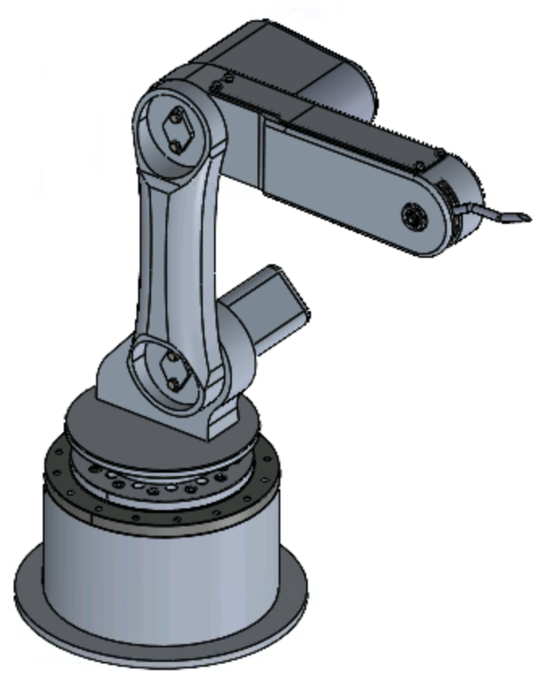
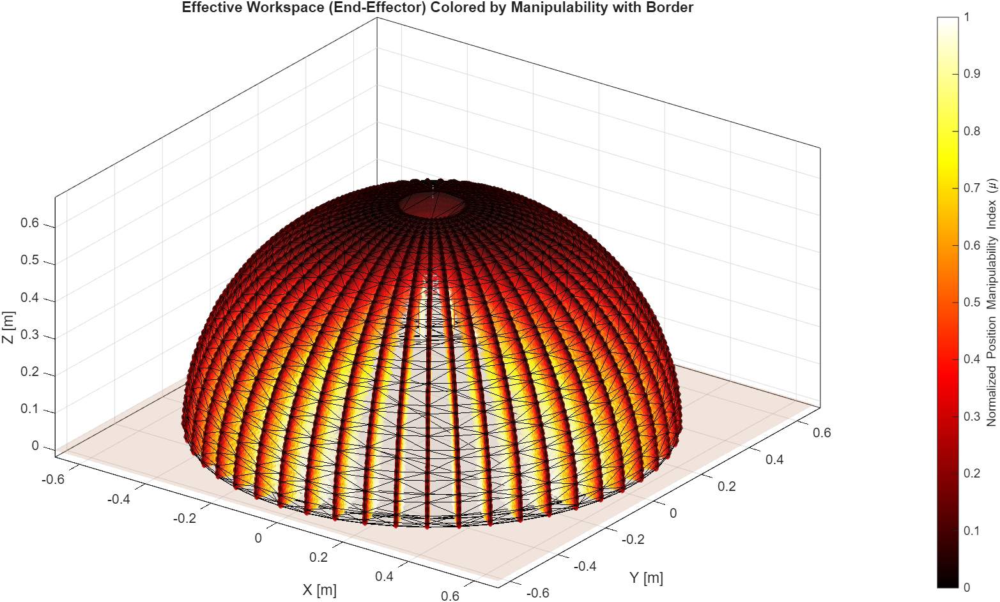
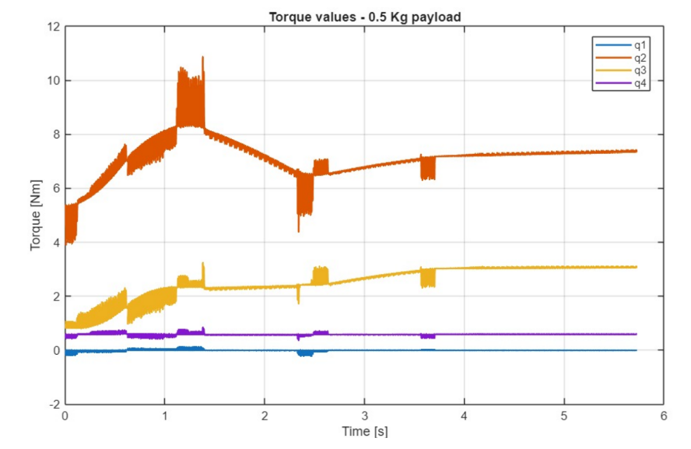

# 4-DOF SCARA Robot for Smart Visor Automation

Industrial Robotics course project — Politecnico di Milano (2025/26).

Design, modeling and simulation **from scratch** of a 4-axis collaborative SCARA robot that performs two pick-and-place / inspection trajectories, with full kinematics, dynamics, trajectory planning and motor sizing.

**Team:** Jessica Dichakdjian · Keylian Paris · Mateo Zeneli

<p align="center">
  
</p>

---

## Overview

- **Robot:** 4-DOF SCARA arm, aluminum structure (6061-T6), revolute joints + belt drive (no gearbox)
- **Payload:** 0.5 kg (analyzed up to 1 kg)
- **Tools:** SolidWorks (CAD), MATLAB + Simulink/Simscape (kinematics, dynamics, simulation)
- **Motors:** Mitsubishi HG-MR13 / HG-MR23 servomotors, GT2 belt + pulley transmission

### The two tasks

| Trajectory | Method | Character |
|---|---|---|
| **A→B→B2→C** (ABC) | Lines & Parabolas (trapezoidal, minimum-time) | Fast pick-and-place; higher torque peaks |
| **A→D→D2→E** (ADE) | Cubic splines | Smooth inspection motion; lower dynamic stress |

Key results: Joint 2 (shoulder) dominates torque demand (peak ≈ 9.3 → 14.1 Nm with payload on ABC); MATLAB inverse dynamics validated against Simscape.

| Workspace (manipulability map) | Joint torques – ABC, 0.5 kg payload |
|---|---|
|  |  |


*Motor-side torques with belt transmission (1 kg payload) vs HG-MR13 / HG-MR23 rated and max torque limits.*

---

## Repository structure

```
├── matlab/                  Kinematics, dynamics & trajectory planning
│   ├── ABC_Trajectory.m       Main script — ABC task (Lines & Parabolas)
│   ├── Main_ADE.m             Main script — ADE task (cubic splines)
│   ├── plot_simscape_values.m           Extract q, q̇, q̈, τ from Simscape run
│   ├── Comparison_Matlab_Simscape_ABCtraj.m   MATLAB vs Simscape validation
│   ├── Motor_sizing_Beta_Alpha.m        Motor sizing (α–β method, τ_opt)
│   ├── lib/                   Shared functions (IK/FK, Jacobian, M/C/G, profiles, plotting)
│   ├── demos/                 Kinematics test scripts (FK/IK check, S-shape motion)
│   ├── legacy/                Earlier trajectory iterations
│   └── data/                  Exported joint trajectories for Simscape (.mat)
├── simscape/                Multibody simulation
│   ├── SCARA_Simscape.slx     Simscape Multibody model
│   ├── step/                  STEP geometry imported by the model
│   ├── task_space/            Task-space planning: DH forward kinematics (fk_robot_13.m),
│   │                          numerical IK (fminsearch), Cartesian line+arc trajectory, Prova_2.slx
│   └── *.m                    Trajectory generation scripts used by the model
├── cad/                     Technical drawings (PDF) + Bill of Materials
│   ├── drawings/              Exploded views: base, arms, gripper, full assembly
│   └── step/                  Work-object geometry (helmet / visor STEP)
├── docs/                    Project presentation + motor datasheets
└── media/                   Simulation videos + README figures
```

## How to run

1. Open MATLAB in `matlab/` and add the helper folders to the path:
   ```matlab
   addpath('lib','demos','legacy','data')
   ```
2. Run a task:
   - `ABC_Trajectory` — trapezoidal (L&P) trajectory, dynamics, torque plots, animation; exports `SCARA_pos_simscape.mat`
   - `Main_ADE` — cubic-spline trajectory, dynamics, torque plots, 3D animation; exports `ADE_traj.mat`
3. Simulate in Simscape: open `simscape/SCARA_Simscape.slx` (loads the exported `.mat` joint signals via *From Workspace* blocks), then post-process with `plot_simscape_values.m` and compare using `Comparison_Matlab_Simscape_ABCtraj.m`.
4. Motor sizing: after a Simscape run, execute `Motor_sizing_Beta_Alpha.m` (α–β method with optimal transmission-ratio table).
5. Task-space planning: `simscape/task_space/` contains the full-DH forward kinematics, the numerical IK (`fminsearch`, sub-millimeter accuracy) and the Cartesian line + semicircle trajectory used in `Prova_2.slx`.

**Requirements:** MATLAB + Simulink + Simscape Multibody (R2023b or later recommended), Curve Fitting Toolbox (`fnder`).

## Documentation

- `docs/Project_Presentation.pptx` — full project presentation (CAD model, workspace map, dynamics, torque analysis, performance)
- `cad/BOM_SCARA_Assembly.pdf` — Bill of Materials
- `docs/HG-MR13.pdf`, `docs/HG-MR23.pdf` — servomotor datasheets
